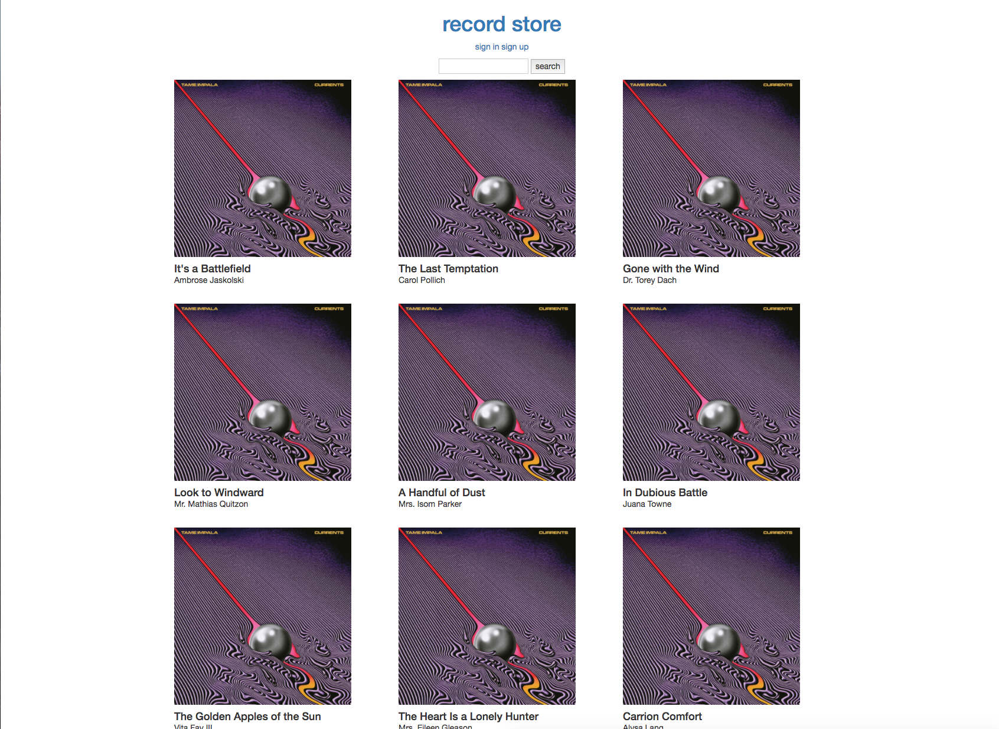
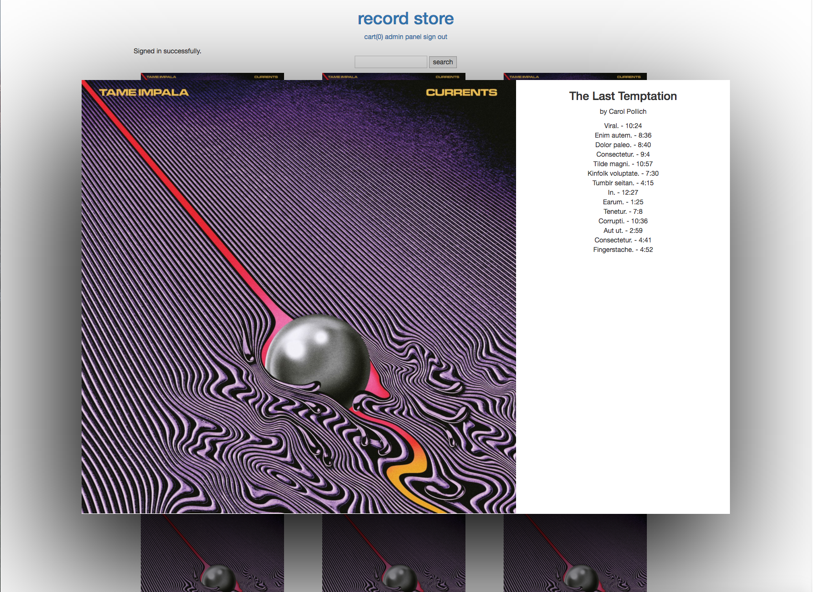
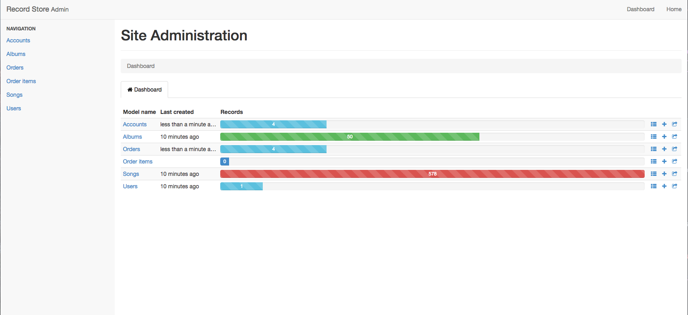
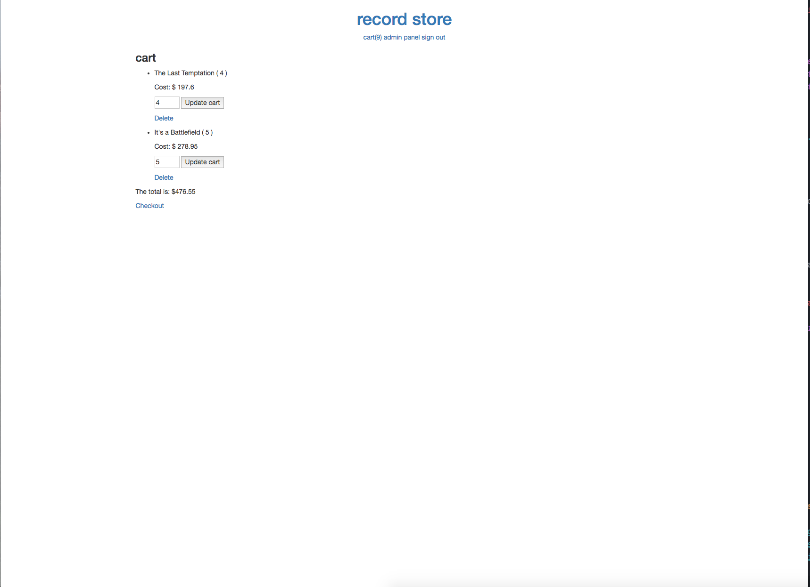

# James and Aubrey's Record Store

#### _This e-commerce site lets users purchase albums._

Visit Live Site [here](https://james-and-aubrey-record-store.herokuapp.com/)

#### By _**James Higgins & Aubrey Masten**_

## Description

_Admins can login and add, edit and delete albums. Users can create an account, login and add items to the cart. Users can edit and delete items from their account and checkout to complete the order._

## Setup/Installation Requirements

### Access Atom Files

* _Ensure connection to the Internet_
* _On a mac using spotlight search type in terminal_
* _Once in terminal enter the following commands to clone the file to your desktop and open the repository:_
```
$ cd desktop
$ git clone https://github.com/jamesmilanhiggins/record-store
$ cd record-store
$ bundle
$ rake db:setup
$ rails s
$ open localhost:3000 in your browser
```

## Known Bugs

* There are no known bugs at this time


## Support and contact details

_Please contact James Higgins at James.Milan.Higgins@gmail.com if you have any questions._

## Technologies Used

* Ruby
* Rails
* Bootstrap
* Javascript
* jQuery

### License

*This software is licensed under MIT license.*

Copyright (c) 2017 **_James Higgins & Aubrey Masten**





